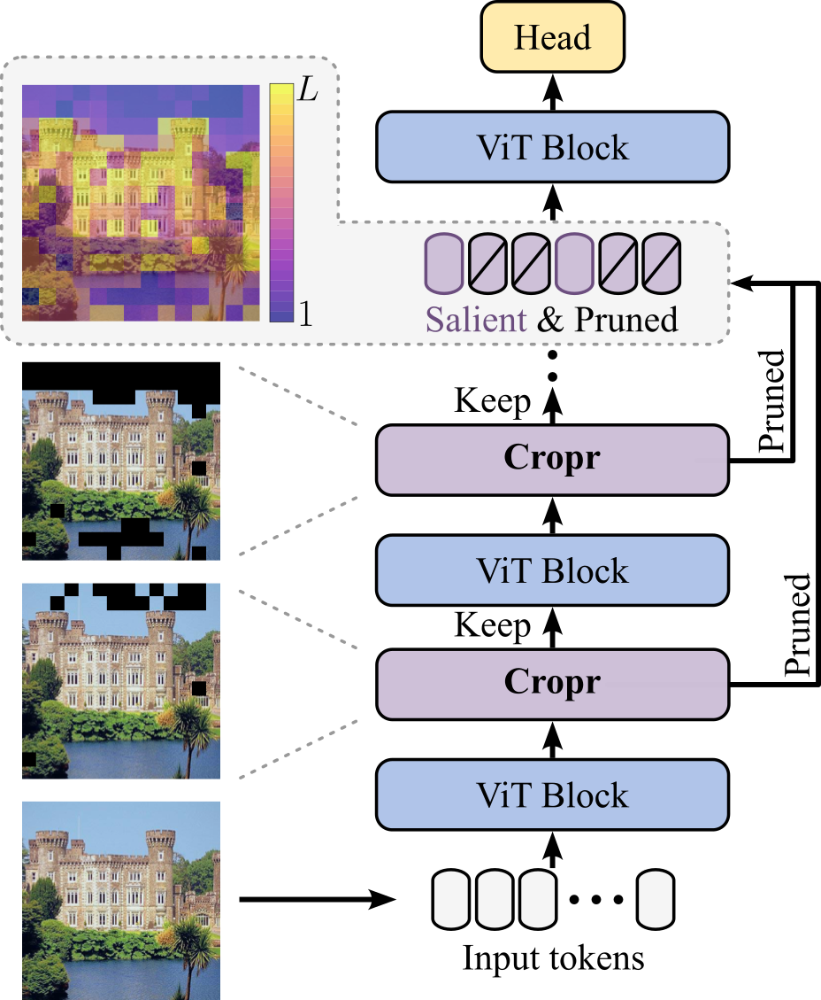

# Token Cropr

Official implementation of "Token Cropr: Faster ViTs for Quite a Few Tasks" in PyTorch.
<br><br>

<p align="center">

</p>
<br>

**Cro**ss-attention **pr**uning (**Cropr**) is a token pruner that uses auxiliary heads to learn to select tokens end-to-end based on task relevance. Cropr modules successively prune less relevant tokens, retaining only the most discriminative tokens for deeper layers. By decreasing the token count in this way, ViTs are accelerated while maintaining high performance. Cropr is applicable to various vision tasks, such as image classification, semantic segmentation, object detection, and instance segmentation.
<br><br>

Check ```cls/CLASSIFICATION.md``` for training a Cropr model on ImageNet.
