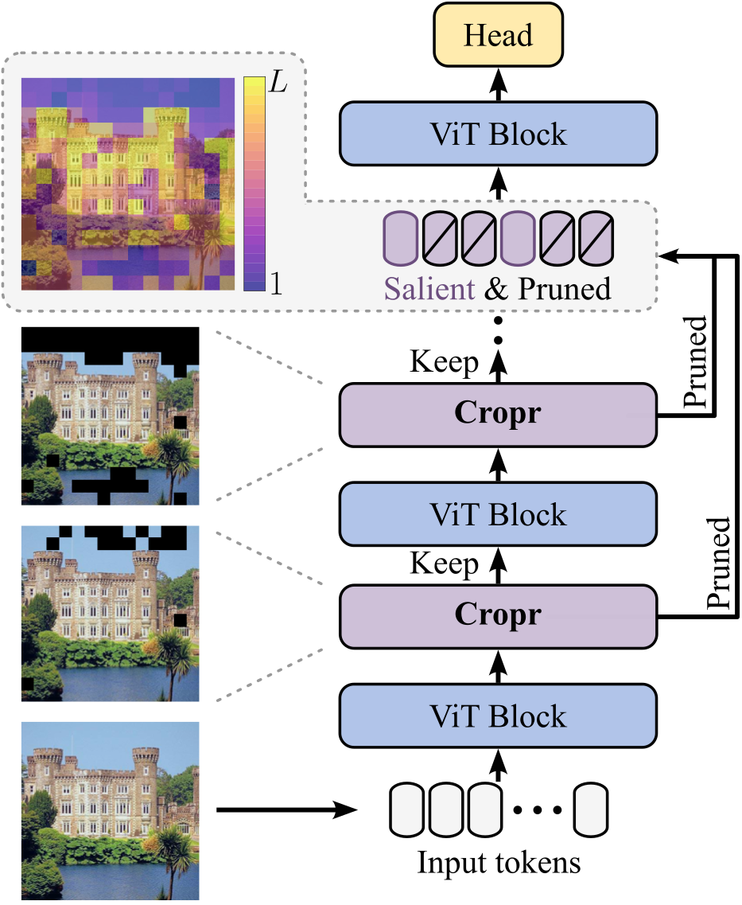

# Token Cropr

Official implementation of "Token Cropr: Faster ViTs for Quite a Few Tasks" in PyTorch.
<br>
<br>

<p align="center">


</p>

The adoption of Vision Transformers (ViTs) in resource-constrained applications necessitates improvements in inference throughput. To this end several token pruning and merging approaches have been proposed that improve efficiency by successively reducing the number of tokens. However, it remains an open problem to design a token reduction method that is fast, maintains high performance, and is applicable to various vision tasks. In this work, we present a token pruner that uses auxiliary prediction heads that learn to select tokens end-to-end based on task relevance. These auxiliary heads can be removed after training, leading to throughput close to that of a random pruner. We evaluate our method on image classification, semantic segmentation, object detection, and instance segmentation, and show speedups of 1.5 to 4x with small drops in performance. As a best case, on the ADE20k semantic segmentation benchmark, we observe a 2x speedup relative to the no-pruning baseline, with a negligible performance penalty of 0.1 median mIoU across 5 seeds.

The adoption of Vision Transformers (ViTs) in resource-constrained applications necessitates improvements in inference throughput. To this end several token pruning and merging approaches have been proposed that improve efficiency by successively reducing the number of tokens. However, it remains an open problem to design a token reduction method that is fast, maintains high performance, and is applicable to various vision tasks. In this work, we present a token pruner that uses auxiliary prediction heads that learn to select tokens end-to-end based on task relevance. These auxiliary heads can be removed after training, leading to throughput close to that of a random pruner. We evaluate our method on image classification, semantic segmentation, object detection, and instance segmentation, and show speedups of 1.5 to 4x with small drops in performance. As a best case, on the ADE20k semantic segmentation benchmark, we observe a 2x speedup relative to the no-pruning baseline, with a negligible performance penalty of 0.1 median mIoU across 5 seeds.
<br>

arXiv: https://arxiv.org/abs/2412.00965

## Usage
arXiv: https://arxiv.org/abs/2412.00965

## Usage

Check ```cls/CLASSIFICATION.md``` for training a Cropr model on ImageNet.
Check ```segm/SEGMENTATION.md``` for training a Cropr model on ADE20k.

## Citation

```bibtex
@article{bergner2024token,
  title={Token Cropr: Faster ViTs for Quite a Few Tasks},
  author={Bergner, Benjamin and Lippert, Christoph and Mahendran, Aravindh},
  journal={arXiv preprint arXiv:2412.00965},
  year={2024}
}
```
